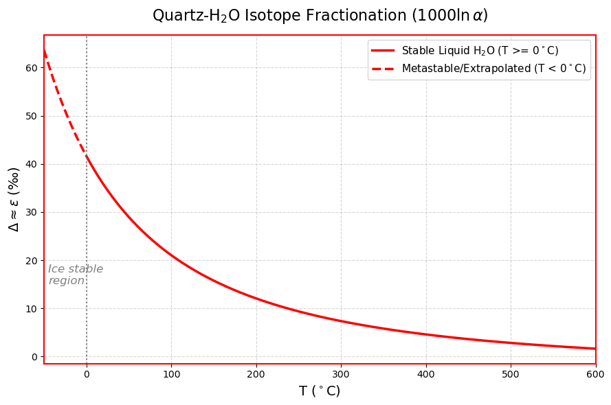

### 1. 绘图说明
上图基于经验公式 $1000\ln\alpha = 3.306 \times (10^6 / T^2) - 2.71$ 绘制了石英与水之间的氧同位素分馏系数随温度（-50℃ ~ 600℃）的变化趋势。
从数学形态上看，该曲线符合稳定同位素分馏的经典热力学规律：在低温区（高温项 $1/T^2$ 占主导）分馏效应极强；随着温度升高，曲线曲率逐渐变缓，分馏系数在高温区逐渐趋近于 0（即两相同位素组成趋于一致）。

### 2. 地质边界与模型局限性讨论
需要指出的是，上述连续曲线代表的是石英-纯液态水体系的理想数学外推。在实际的地质与物理化学环境中，将该公式直接跨越 -50℃ 到 600℃ 的全温区应用存在以下物理局限性：

*   **低温区（< 0℃）的相变截断**：
    在标准大气压下，0℃ 以下水将发生相变结冰。由于重同位素（$^{18}$O）会优先富集于固相（冰）中，冰-水之间存在约 $+3.0‰ \sim +3.5‰$ 的分馏差。因此，0℃ 以下若为石英与冰平衡，其真实分馏系数应比图示曲线低约 3.5‰。图中 0℃ 以下的平滑延伸线，在物理学上仅能代表纯数学外推或极端条件下的亚稳态过冷水体系。

*   **高温区（> 374℃）的超临界与压力效应**：
    当温度超过 374℃（水的临界点）时，液态水转变为超临界流体。文献表明，在高温高压的深部地壳环境中，水流体的密度与压力会显著影响其振动频率，进而对同位素分馏产生额外的压力效应。此时的分馏不再是单纯的温度函数。

*   **天然流体的盐效应**：
    该基线模型假设流体为纯水。而在实际的成岩成矿流体（如地下卤水）中，溶解盐类（如 $Na^+$, $Cl^-$ 等）会改变水分子的内部氢键结构，从而引起分馏系数偏离纯水模型。
